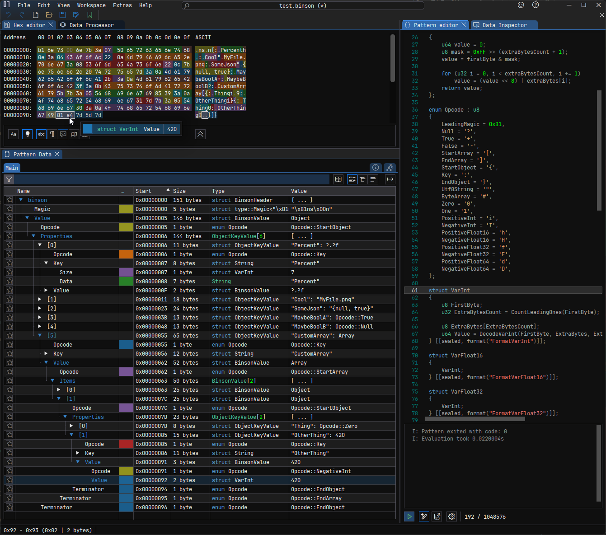

# Binson

## Opcodes

```cs
enum Opcodes : byte
{
	Null = '?',
	False = '-',
	True = '+',
	Zero = '0',
	One = '1',
	StartArray '[',
	EndArray = ']',
	StartObject = '{',
	Key = ':',
	EndObject = '}',
	Utf8String = '"',
	ByteArray = '#',
	PositiveInt = 'i',
	NegativeInt = 'I',
	PositiveFloat16 = 'h',
	NegativeFloat16 = 'H',
	PositiveFloat32 = 'f',
	NegativeFloat32 = 'F',
	PositiveFloat64 = 'd',
	NegativeFloat64 = 'D',
}
```

Integers are encoded using variable-length encoding scheme similar to UTF-8's codepoints, minus the continuation bit.

Floats are encoded by zeroing the sign bit, reinterpreting to an unsigned integer, and then reversing the order of the bits.
This resulting integer is then written out with the variable-length integer encoding scheme.
The bit reversal results in smaller integer values for floats with fewer decimal points, resulting in them being encoded
in fewer bytes.

With both integers and floats, the opcode used acts as the sign bit, informing the decoder whether the value is positive or negative,
and thus var. integers encode only positive/unsigned values.

Strings and byte arrays are encoded by prefixing the data bytes with a variable-length integer representing the length.

See the [ImHex hexpat](Binson.hexpat) definition for more specifics.
Note that floats only decode into their variable-length integer representation, and are not at present reinterpret cast
back into a float for previewing.



## Sample file

### Json source

```json
{
	"Percent": 0.5,
	"Cool": "MyFile.png",
	"SomeJson": "{null, true}",
	"MaybeBoolA": true,
	"MaybeBoolB": null,
	"CustomArray": [
		{"Thing": 1337, "OtherThing": 1},
		{"Thing": 0, "OtherThing": -420},
	],
}
```

### Binson equivalent

```
          00 01 02 03 04 05 06 07  08 09 0a 0b 0c 0d 0e 0f

00000000  b1 6e 73 00 6e 7b 3a 07  50 65 72 63 65 6e 74 68  .ns.n{:.Percenth
00000010  0e 3a 04 43 6f 6f 6c 22  0a 4d 79 46 69 6c 65 2e  .:.Cool".MyFile.
00000020  70 6e 67 3a 08 53 6f 6d  65 4a 73 6f 6e 22 0c 7b  png:.SomeJson".{
00000030  6e 75 6c 6c 2c 20 74 72  75 65 7d 3a 0a 4d 61 79  null, true}:.May
00000040  62 65 42 6f 6f 6c 41 2b  3a 0a 4d 61 79 62 65 42  beBoolA+:.MaybeB
00000050  6f 6f 6c 42 3f 3a 0b 43  75 73 74 6f 6d 41 72 72  oolB?:.CustomArr
00000060  61 79 5b 7b 3a 05 54 68  69 6e 67 69 85 39 3a 0a  ay[{:.Thingi.9:.
00000070  4f 74 68 65 72 54 68 69  6e 67 31 7d 7b 3a 05 54  OtherThing1}{:.T
00000080  68 69 6e 67 30 3a 0a 4f  74 68 65 72 54 68 69 6e  hing0:.OtherThin
00000090  67 49 81 a4 7d 5d 7d                              gI..}]}

                     b1 6e 73 00 6e  Magic
                                 7b  StartObject
                              3a 07    Key (7)
               50 65 72 63 65 6e 74      "Percent"
                              68 0e      PositiveFloat16 (0.5f)
                              3a 04    Key (4)
                        43 6f 6f 6c      "Cool"
                              22 0a      Utf8String (10)
      4d 79 46 69 6c 65 2e 70 6e 67        "MyFile.png"
                              3a 08    Key (8)
            53 6f 6d 65 4a 73 6f 6e      "SomeJson"
                              22 0c      Utf8String (12)
7b 6e 75 6c 6c 2c 20 74 72 75 65 7d        "{null, true}"
                              3a 0a    Key (10)
      4d 61 79 62 65 42 6f 6f 6c 41      "MaybeBoolA"
                                 2b      True
                              3a 0a    Key (10)
      4d 61 79 62 65 42 6f 6f 6c 42      "MaybeBoolB"
                                 3f      Null
                              3a 0b    Key (11)
   43 75 73 74 6f 6d 41 72 72 61 79      "CustomArray"
                                 5b      StartArray
                                 7b        StartObject
                              3a 05          Key (5)
                    54 68  69 6e 67            "Thing"
                           69 85 39            PositiveInt (1337)
                              3a 0a          Key (10)
      4f 74 68 65 72 54 68 69 6e 67            "OtherThing"
                                 31            One
                                 7d        EndObject
                                 7b        StartObject
                              3a 05          Key (5)
                     54 68 69 6e 67            "Thing"
                                 30            Zero
                              3a 0a          Key (10)
      4f 74 68 65 72 54 68 69 6e 67            "OtherThing"
                           49 81 a4            NegativeInt(420)
                                 7d        EndObject
                                 5d      EndArray
                                 7d  EndObject
```
